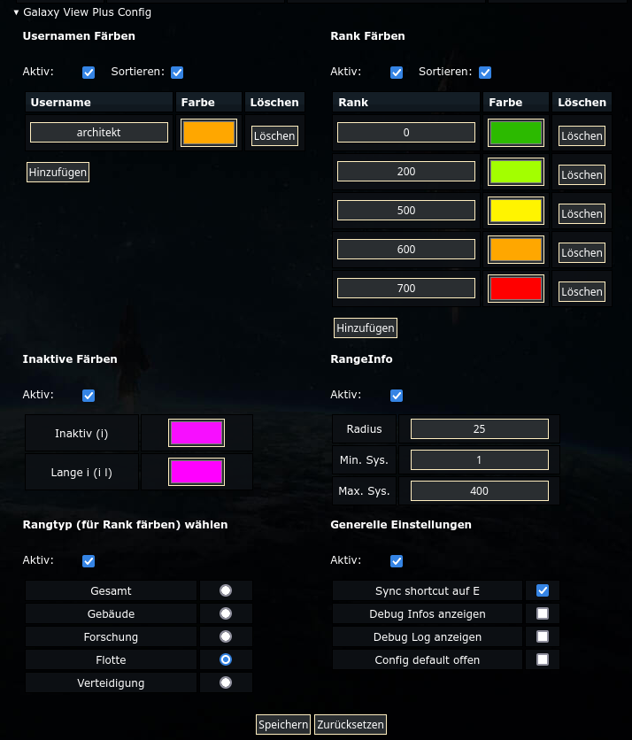
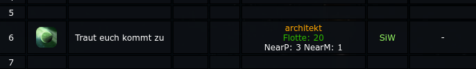

# GalaxyViewPlus 

Tampermonkey/Greasmonkey/ViolentMonkey(?) Plugin für pr0game.com 

[GalaxyViewPlus installieren](https://raw.githubusercontent.com/ArchitektApx/GalaxyViewPlus/master/GalaxyViewPlus.user.js)
## Galaxy Menü

Das Skript fügt unter dem Galaxy Menü ein Settings Menü hinzu welches diverse QoL Features steuert.

## Features

- Usernamen einfärben
- Rank anzeigen und einfärben
- Inaktive einfärben
- RangeInfo anzeigen (Planeten/Monde in der Umgebung)
- Auswahl welcher Rank angezeigt wird 
- Shortcut für den Syncbutton

## Ergebnis

## Eigene/Custom Features

Das Skript lässt sich einfach um eigene Features erweitern. Anleitung folgt...